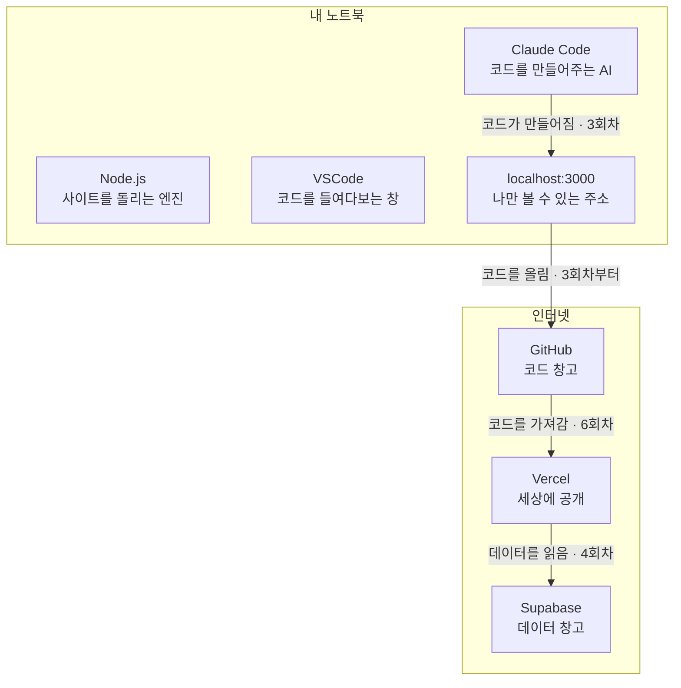

import { Card, CardGrid } from '@astrojs/starlight/components';

> **읽는 시점:** 신청 직후 · 1회차 전
> **읽는 시간:** 10분
> 지금 다 이해 안 돼도 괜찮습니다. 회차마다 하나씩 준비합니다.

---

## 먼저, 큰 그림

우리는 코드를 직접 쓰지 않습니다. **AI에게 말로 시킵니다.**
그런데 AI가 만든 코드는 어딘가에서 돌아가야 하고, 어딘가에 저장돼야 하고, 어딘가에 공개돼야 해요.

그 "어딘가"가 6개 있습니다.



AI가 만드는 코드는 **Next.js + TypeScript + Tailwind CSS** 입니다.

우리가 직접 쓰지는 않지만, 이름 정도는 알아두시면 코드를 봤을 때 덜 당황해요. 자세한 설명은 3회차에 있습니다.

<CardGrid>
	<Card title="Node.js" icon="node">
		사이트를 돌리는 엔진
	</Card>
	<Card title="VSCode" icon="vscode">
		코드를 보는 창
	</Card>
	<Card title="Claude Code / Codex" icon="rocket">
		코드를 만드는 AI
	</Card>
	<Card title="GitHub" icon="github">
		코드 창고
	</Card>
	<Card title="Supabase" icon="database">
		데이터 창고
	</Card>
	<Card title="Vercel" icon="vercel">
		공개 서버
	</Card>
</CardGrid>

---

## 1. Node.js

**한 줄:** 내 노트북에서 웹사이트를 돌리는 엔진

**왜 필요한가**
React로 만든 사이트는 그냥 파일을 더블클릭한다고 열리지 않습니다. 엔진이 있어야 돌아가요. 자동차에 엔진이 있어야 굴러가는 것과 같습니다.

**어디까지 하나**
설치만 하면 끝. LTS 버전(안정 버전)을 고르시면 됩니다.

**됐는지 확인**
터미널에 이렇게 칩니다.
```
node -v
```
`v20.11.0` 같은 숫자가 나오면 성공.

**자주 나는 문제**
설치했는데 `node -v`가 안 먹혀요 → 터미널을 껐다가 다시 켜보세요. 거의 이걸로 해결됩니다.

**준비 회차:** 1회차

---

## 2. VSCode

**한 줄:** 코드 파일들이 담긴 폴더를 열어보는 창

**왜 필요한가**
AI가 코드를 만들면 파일이 폴더 안에 쌓입니다. 그게 몇 개인지, 어디 있는지 눈으로 봐야 할 때가 있어요. 그때 여는 창입니다.

**알아둘 것**
코드를 직접 쓰라고 있는 게 아닙니다. **보라고 있는 겁니다.** 그리고 2회차부터는 이 VSCode 안에 Claude 채팅창을 띄워놓고, 거기서 AI와 대화하며 작업합니다.

**어디까지 하나**
설치하고 한 번 열어보기.

**됐는지 확인**
프로그램이 열리고 왼쪽에 파일 목록이 보이면 성공.

**준비 회차:** 1회차

---

## 3. Claude Code 또는 Codex

**한 줄:** 대화로 코드를 만들어주는 AI

**왜 필요한가**
이 커뮤니티의 핵심입니다. `"리뷰 입력 폼을 만들어줘"` 라고 치면 AI가 알아서 파일을 만들고 코드를 씁니다.

**둘 중 하나만 씁니다**

| 내 구독 | 쓸 도구 |
|---|---|
| Claude Pro / Max | **Claude Code** |
| ChatGPT Plus / Pro | **Codex** |

**중요: 웹 채팅과 다릅니다**

claude.ai나 chatgpt.com에서 코드를 물어보고 복사해서 붙여넣는 방식이 아닙니다.
Claude Code는 **내 폴더의 파일을 직접 만들고 명령어까지 실행합니다.**

이 차이가 이 커뮤니티가 3주 만에 배포까지 가는 이유예요. 복붙하지 않으니까요.

**어디까지 하나**
설치 + 내 구독 계정으로 로그인.

**Claude Code 설치 (Claude 구독자)**
```
npm install -g @anthropic-ai/claude-code
```
그다음 프로젝트 폴더에서:
```
claude
```
처음 실행하면 로그인 화면이 뜹니다. Claude Pro/Max 계정으로 로그인하면 별도 결제 없이 쓰실 수 있어요.

> **2회차부터는 검은 터미널 대신 VSCode 확장을 씁니다.**
> VSCode 안에 채팅창을 띄워서 쓰는 방식이고, 훨씬 편합니다.

<div class="doc-link">
	<p class="doc-link-label">설치와 여는 방법</p>
	<p class="doc-link-to">왼쪽 메뉴 → 준비 → 작업 공간 만들기</p>
	<p class="doc-link-desc">확장 설치부터 모델·모드 설정까지 클릭 하나하나 적어뒀어요.</p>
</div>

**Codex 설치 (ChatGPT 구독자)**
```
npm install -g @openai/codex
```
그다음 프로젝트 폴더에서:
```
codex
```
처음 실행 시 브라우저가 뜨면 ChatGPT Plus/Pro 계정으로 로그인합니다.
*(VS Code를 쓰시는 분은 VS Code 확장 마켓플레이스에서 OpenAI Codex 또는 GitHub Copilot 확장을 설치하여 연동할 수도 있습니다.)*

> 설치 명령어는 업데이트될 수 있습니다. 실행이 잘 되는지 1회차에 다 같이 확인합니다.

**됐는지 확인**
실행했을 때 AI가 대화를 받아주면 성공.

**준비 회차:** 1회차

---

## 4. GitHub

**한 줄:** 내 코드를 인터넷에 보관하는 창고

**왜 필요한가**
6회차에 배포할 때 Vercel이 **GitHub에서 코드를 가져갑니다.** 여기 코드가 없으면 배포를 못 해요.

**용어 세 개만**

| 말 | 뜻 |
|---|---|
| **저장소 (repository, repo)** | 프로젝트 하나가 통째로 들어가는 폴더 |
| **커밋 (commit)** | "여기까지 작업한 걸 저장" 하는 것 |
| **푸시 (push)** | 내 노트북에 저장한 걸 GitHub로 올리는 것 |

**어디까지 하나 — 나눠서 합니다**

| 회차 | 뭘 하나 |
|---|---|
| **1회차** | 계정만 만듭니다. 그게 다예요 |
| **3회차** | 저장소를 만들고 **처음 올려봅니다** |
| **4·5회차** | 그날 작업한 걸 한 번씩 더 올립니다 |

1회차에 GitHub까지 다 하려면 세팅만 하다 끝나요. 그래서 계정만 먼저 만듭니다.

**왜 3회차부터 올리나요**
6회차 배포 때 당황하지 않으려고 미리 연습하는 거예요. 그리고 뭔가 크게 망가져도 **저장해둔 지점으로 돌아올 수 있습니다.**

**됐는지 확인 (1회차)**
github.com에 로그인이 되면 끝.

**준비 회차:** 1회차(계정) · 3회차(첫 푸시)

---

## 5. Supabase

**한 줄:** 데이터를 저장하는 창고 (데이터베이스)

**왜 필요한가**
3회차에 만든 화면은 예쁘기만 하고 아무것도 기억하지 못합니다. 사용자가 리뷰를 써도 새로고침하면 사라져요.

Supabase가 그 데이터를 대신 보관해줍니다.

**어디까지 하나**
1. 가입 (GitHub 계정으로 3초)
2. 프로젝트 하나 만들기
3. 테이블 하나 만들기 — 화면에서 클릭으로. **SQL 안 씁니다**
4. API 키 2개 복사해두기

**API 키가 뭔가요**

내 데이터 창고의 **주소와 열쇠**입니다.

| 이름 | 뭔가 |
|---|---|
| **Project URL** | 창고 주소 |
| **anon key** | 창고 문 여는 열쇠 |

이 두 개를 AI에게 주면 나머지는 AI가 코드에 넣어줍니다.

:::caution[이 키는 남에게 보여주지 마세요]
GitHub에 올릴 때도 `.env` 파일에 넣어서 숨깁니다. 이것도 AI가 알아서 하지만, 시킬 때 **"이 키를 .env 에 넣어줘"** 라고 함께 말해두는 게 안전합니다.
:::

**우리가 안 하는 것**
DB 설계, 정규화, SQL, 인덱스 — 안 합니다. 3주 안에 하기도 어렵고, 지금 필요하지도 않아요.
`이름`, `내용`, `날짜` 정도의 칸을 클릭으로 만들면 끝입니다.

**준비 회차:** 4회차

---

## 6. Vercel

**한 줄:** 내 사이트를 세상에 공개하는 서버

**왜 필요한가**
`localhost:3000`은 **내 노트북에서만** 열립니다. 옆 사람 컴퓨터에서는 안 열려요.
Vercel에 올려야 누구나 열 수 있는 진짜 주소가 생깁니다.

**어디까지 하나 — 두 번에 나눠서**

| 회차 | 뭘 하나 |
|---|---|
| **5회차** | 계정만 만듭니다. GitHub 계정으로 로그인하면 3초 |
| **6회차** | GitHub 저장소를 연결하고 배포합니다 |

**배포하면 이런 주소가 생깁니다**
```
https://내프로젝트이름.vercel.app
```

**환경 변수 (6회차의 진짜 벽)**

4회차에 복사해둔 Supabase 키 2개를 Vercel에도 등록해야 합니다.

**왜?** 지금까지 그 키는 내 노트북 `.env` 파일에만 있었어요. 그런데 사이트는 이제 Vercel 서버에서 돌아갑니다. 그 서버도 열쇠가 있어야 창고에 접속할 수 있겠죠.

등록을 안 하면 배포는 됩니다. 다만 사이트에 들어가도 데이터가 안 나와요.

**준비 회차:** 5회차(계정) · 6회차(배포)

---

## 전체 요약표

| 도구 | 왜 | 준비 회차 | 어디까지 |
|---|---|---|---|
| **Node.js** | 사이트를 돌리는 엔진 | 1회차 | 설치 |
| **VSCode** | 코드를 보는 창 | 1회차 | 설치 |
| **Claude Code / Codex** | 코드를 만드는 AI | 1회차 | 설치 + 로그인 |
| **GitHub** | 코드 창고 | 1회차 / 3회차 | 계정 → 저장소 + 푸시 |
| **Supabase** | 데이터 창고 | 4회차 | 프로젝트 + 테이블 + 키 복사 |
| **Vercel** | 공개 서버 | 5회차 / 6회차 | 계정 → 배포 + 환경 변수 |

---

## 자주 나오는 질문

**Q. 이 6개를 다 알아야 하나요?**
아니요. 왜 있는지만 아시면 됩니다. 사용법은 AI가 알려주고, 막히면 옆 사람과 타스가 있어요.

**Q. 다 무료인가요?**
Node.js, VSCode, GitHub는 완전 무료입니다.
Supabase와 Vercel은 무료 플랜으로 충분해요.
Claude Code / Codex는 이미 갖고 계신 유료 구독으로 씁니다. 추가 결제 없습니다.

**Q. 회사 노트북으로 하면 안 되나요?**
관리자 권한이 없으면 Node.js 설치부터 막혀서 1회차에 진행이 어려워집니다. 되도록 **개인 노트북**을 가져오세요.

**Q. 맥북은요?**
이번 시즌은 Windows 기준으로 안내합니다. 맥도 되지만 진행 중에 도움 드리기 어려울 수 있어요.
