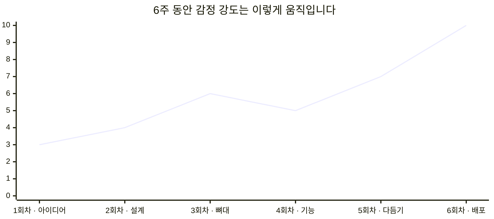
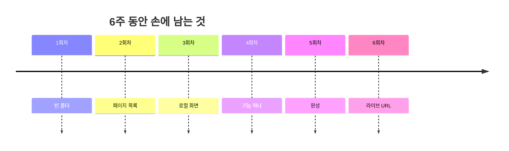

## 6회차 진행 곡선

```mermaid
---
config:
  xyChart:
    width: 900
    height: 400
---
xychart-beta
    title "6주 동안 감정 강도는 이렇게 움직입니다"
    x-axis ["1회차 · 아이디어", "2회차 · 설계", "3회차 · 뼈대", "4회차 · 기능", "5회차 · 다듬기", "6회차 · 배포"]
    y-axis 0 --> 10
    line [3, 4, 6, 5, 7, 10]
```

## 결과물 타임라인

```mermaid
timeline
    title 6주 동안 손에 남는 것
    1회차 : 빈 폴더
    2회차 : 페이지 목록
    3회차 : 로컬 화면
    4회차 : 기능 하나
    5회차 : 완성
    6회차 : 라이브 URL
```

