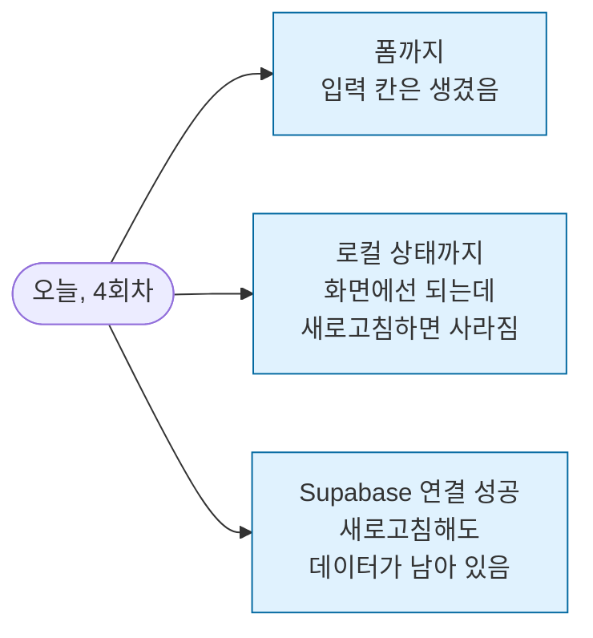

<div class="today-stats">
	<div class="stat">
		<p class="stat-label">오늘의 목표</p>
		<p class="stat-value">어제 뜬 화면에 기능 하나 붙이기</p>
	</div>
	<div class="stat">
		<p class="stat-label">오늘 손에 남는 것</p>
		<p class="stat-value">사람마다 다릅니다. 그게 오늘의 정상입니다.</p>
	</div>
</div>

---

## 먼저 읽어주세요

:::danger[오늘이 이번 시즌에서 가장 어려운 회차입니다]
**안 되는 게 많을 겁니다. 에러가 좌르르 뜰 겁니다. 정상입니다.**

오늘은 **완성이 목표가 아닙니다.**
**어디까지 시도해봤는지**가 목표예요.

오늘 다 못 해도 **6일이 남아 있습니다.**
:::

이 문장을 읽고 오셨다는 게 오늘 제일 중요합니다.

---

## 왜 갑자기 어려워지나요

3회차까지는 **화면만** 만들었습니다. 예쁘게 보이기만 하면 됐어요.

오늘부터는 **동작해야 합니다.**
- 버튼을 누르면 뭐가 되어야 하고
- 입력한 게 저장되어야 하고
- 저장한 게 다시 나와야 합니다

이건 완전히 다른 근육입니다. 그리고 여기서 **AI가 답을 뽑아줘도 안 풀리는 순간**을 처음 만납니다.

---

## 오기 전에

- [ ] 어제 만든 홈 화면이 있는 노트북
- [ ] 마음의 준비 (진심입니다)

---

## 오늘 새로 준비하는 것 · Supabase

**Supabase가 뭔가요?**
데이터를 저장하는 창고입니다.

지금 화면은 예쁘기만 하고 **아무것도 기억 못 합니다.** 리뷰를 써도 새로고침하면 사라져요.
Supabase가 그걸 대신 보관해줍니다.

### 어디까지 하나

1. **가입** — supabase.com → GitHub 계정으로 로그인 (3초)
2. **프로젝트 하나 만들기**
3. **테이블 하나 만들기** — 화면에서 클릭으로. **SQL 안 씁니다**
4. **API 키 2개 복사해두기** ← 이거 중요

### API 키가 뭔가요

내 데이터 창고의 **주소와 열쇠**입니다.

| 이름 | 뭔가 |
|---|---|
| **Project URL** | 창고 주소 |
| **anon key** | 창고 문 여는 열쇠 |

이 두 개를 AI에게 주면 나머지는 AI가 코드에 넣어줍니다.

> **⚠️ 주의:** 이 키는 남에게 보여주지 마세요. GitHub에 올릴 때도 `.env` 파일에 숨깁니다.
> AI에게 줄 때 **"이 키를 .env 파일에 넣어줘"** 라고 함께 말하세요.

### 우리가 안 하는 것

DB 설계, 정규화, SQL, 인덱스 — **안 합니다.**
`이름`, `내용`, `날짜` 정도의 칸을 클릭으로 만들면 끝입니다.

---

## 오늘 하는 것 2단계

### 1단계 · 먼저 폼만 만들기 (30분) — 여기까진 6명 다 성공합니다

**Supabase 없이** 화면에서만 되는 걸 먼저 만듭니다.

```
홈 화면에 리뷰를 입력하는 폼을 추가해줘.
입력 칸: 카페 이름, 별점, 한 줄 평
저장 버튼을 누르면 아래 목록에 바로 나타나면 돼.

아직 데이터베이스는 연결하지 마. 화면에서만 되면 돼.
```

**결과:** 입력하고 저장하면 목록에 뜹니다. **새로고침하면 사라집니다.** 괜찮아요.

**오늘의 최소 결과물이 이겁니다.** 여기까지만 해도 오늘 온 보람이 있습니다.

---

### 2단계 · Supabase 연결 시도 (30분) — 여기서부터 갈립니다

```
이제 Supabase에 연결해줘.

내 Supabase 정보야:
Project URL: [붙여넣기]
anon key: [붙여넣기]

테이블 이름은 reviews 이고, 칸은 name, rating, comment 야.

리뷰를 저장하면 Supabase에 들어가고,
새로고침해도 목록이 그대로 남아 있게 해줘.

키는 .env 파일에 넣어서 코드에 직접 안 보이게 해줘.
```

**여기서 첫 에러를 만납니다.**

지금까지는 AI가 뽑아주면 됐어요. 오늘은 뽑아줘도 안 됩니다.
**이 순간이 오늘의 진짜 시작입니다.**

---

## 에러가 났을 때

### 3단계로 하세요

```
1단계 · AI에게 에러 메시지를 그대로 붙여넣는다   (3분)
2단계 · 안 풀리면 카톡방에 스크린샷              (즉시)
3단계 · 옆 사람에게 물어본다
```

**혼자 30분 헤매지 마세요.**

### 에러 프롬프트

```
Supabase를 연결했는데 에러가 나:

[에러 메시지 붙여넣기]

지금 화면에서는 [저장 버튼을 눌러도 아무 일도 안 일어나].
뭘 확인해야 해?
```

### 같은 에러가 세 번째라면

```
같은 에러가 세 번째야. 아까 알려준 방법대로 했는데 또 났어.
지금 상태를 처음부터 다시 확인해줘. 뭘 놓쳤을까?
```

---

## 오늘 손에 남는 것 · 사람마다 다릅니다



**셋 다 오늘의 정상입니다.**

옆 사람이 나보다 앞서 있어도 괜찮아요. **각자 다른 사이트를 만들고 있습니다.**

---

## 오늘의 규칙

- **완성 아닌 시도가 목표**
- **에러 뜨면 3분 이상 혼자 안 헤매기**
- **"저는 폼밖에 못 만들었어요" 라고 말해도 되는 자리**
- **먼저 뚫은 사람은 옆 사람 도와주기**

---

## 마지막 10분 · 도달 지점 나누기

한 사람씩 30초로 말합니다.

> **"저는 오늘 여기까지 왔어요."**

성공이든 실패든 아닙니다. **오늘 어디까지 왔는지**를 나누는 시간입니다.

---

## 다음 회차까지 (6일)

**본인 도달 지점에 따라 과제가 다릅니다.**

| 오늘 여기까지 왔다면 | 6일 안에 할 것 |
|---|---|
| Supabase 연결 성공 | 데이터 정리하고 다듬기 |
| 로컬 상태까지 | **Supabase 연결 시도.** 막히면 카톡방에 |
| 폼까지 | 로컬 상태부터 마무리 + Supabase 시도 |

**공통 과제**
- **다시 하기 (30분)** — 오늘 만든 부분 집에서 한 번 더 실행해보기
- **예열 (15분)** — 5회차는 다듬기입니다. 색·글씨·텍스트 어디 고치고 싶은지 미리 봐두기

### 집에 가서 5분

`CLAUDE.md` 의 `## 데이터 구조` 자리에 Supabase 테이블 이름과 칸 이름을 적어두세요.

```markdown
## 데이터 구조

Supabase 테이블: reviews
- name (카페 이름)
- rating (별점)
- comment (한 줄 평)
```

그러면 다음부터 AI가 매번 안 물어봅니다.

### 카톡방

**목요일 · 일요일 · 화요일 오전**에 타스가 확인 메시지를 보냅니다.
막히면 아무 때나 스크린샷 던지세요. 6일 동안 뚫으면 됩니다.

---

## 다음 회차 예고 · 5회차 다듬기

**딱 두 개 합니다.**
1. 오늘 못 끝낸 것 마무리
2. 내일 배포할 수 있는 완성 상태로 다듬기

그리고 **5회차 다음 날이 배포입니다.**

---

*코딩 없이 코딩 · sessions/4 · 최종 확인 2026-07-10*
