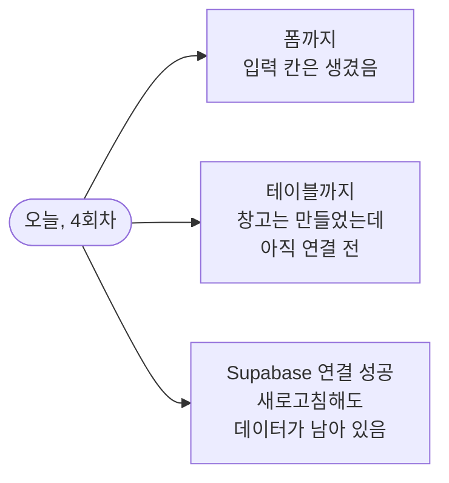

<div class="today-stats">
	<div class="stat">
		<p class="stat-label">오늘의 목표</p>
		<p class="stat-value">어제 뜬 화면에 기능 하나 붙이기</p>
	</div>
	<div class="stat">
		<p class="stat-label">오늘 손에 남는 것</p>
		<p class="stat-value">사람마다 다릅니다. 그게 오늘의 정상입니다.</p>
	</div>
</div>

---

## 먼저 읽어주세요

:::danger[오늘이 이번 시즌에서 가장 어려운 회차입니다]
**안 되는 게 많을 거예요. 에러도 좌르르 뜹니다.** 그게 오늘의 정상입니다.

오늘은 완성이 목표가 아니에요.
**어디까지 시도해봤는지**가 목표입니다.

오늘 다 못 하셔도 6일이 남아 있습니다.
:::

이 문장을 읽고 오셨다는 게 오늘 제일 중요합니다.

---

## 왜 갑자기 어려워지나요

3회차까지는 **화면만** 만들었습니다. 예쁘게 보이기만 하면 됐어요.

오늘부터는 **동작해야 합니다.**
- 버튼을 누르면 뭐가 되어야 하고
- 입력한 게 저장되어야 하고
- 저장한 게 다시 나와야 합니다

이건 완전히 다른 근육이에요. 그리고 여기서 AI가 답을 뽑아줘도 바로 안 풀리는 순간을 처음 만나게 됩니다.

---

## 오기 전에

- [ ] 어제 만든 화면들이 있는 노트북 (클릭해서 돌아다녀지는 그 상태)
- [ ] **지난 시간 미리 가입한 Supabase 계정 및 프로젝트 준비**
- [ ] 가벼운 마음의 준비 (조금은 진심입니다)

---

## 오늘 새로 준비하는 것 · Supabase

**Supabase가 뭔가요?**
데이터를 저장하는 창고입니다.

지금 화면은 예쁘기만 하고 아무것도 기억하지 못합니다. 리뷰를 써도 새로고침하면 사라져요.
Supabase가 그걸 대신 보관해줍니다.

### 오늘의 순서 (중요)

<mark>테이블은 폼을 만든 다음에 만듭니다.</mark> 순서가 반대면 오늘 제일 많이 고생하시게 돼요.

1. **로그인 & 프로젝트 확인** — 지난 시간에 가입해둔 supabase.com에 로그인
2. **API 키 2개 복사해두기** ← 이거 중요
3. **테이블 만들기** — **1단계 폼을 만든 뒤에**, 2단계에서 합니다

:::note[왜 폼을 먼저 만드나요]
테이블의 칸 이름은 **폼의 입력 칸에서 나옵니다.**

먼저 테이블부터 만들면, 아직 정해지지도 않은 칸을 추측해서 만들게 돼요.
그러다 이름이 하나만 어긋나도 <mark>저장이 통째로 안 됩니다.</mark>

폼을 먼저 만들면 AI가 그 화면을 보고 칸 이름을 맞춰서 뽑아줍니다.
:::

### API 키가 뭔가요

내 데이터 창고의 **주소와 열쇠**입니다.

| 이름 | 뭔가 |
|---|---|
| **Project URL** | 창고 주소 |
| **publishable key** (예전 이름 `anon`) | 손님용 열쇠 — 내 사이트에 넣고 쓰는 것 |

이 두 개를 AI에게 주면 나머지는 AI가 코드에 넣어줍니다.

:::danger[`secret` 이라고 적힌 키는 절대 복사하지 마세요]
같은 화면에 열쇠가 **두 종류** 있습니다. 이름만 잘 보시면 돼요.

| 복사할 것 | 절대 안 되는 것 |
|---|---|
| `sb_publishable_...` | `sb_secret_...` |
| (예전 이름 `anon`) | (예전 이름 `service_role`) |

**`secret` · `service_role` 쪽은 주인용 마스터 키예요.** 이게 사이트에 들어가면 잠금장치를 전부 무시하고 남이 내 데이터를 통째로 지울 수 있습니다.

헷갈리시면 복사하기 전에 손 들어주세요. 30초면 같이 확인해드려요.
:::

:::note[`publishable` 키는 채팅창에 붙여넣어도 괜찮아요]
이 열쇠는 **원래 공개되는 용도**입니다. `.env` 에 넣어도 결국 내 사이트 코드에 실려서 나가요.

그래서 진짜 잠금장치는 키가 아니라 **Supabase 쪽 설정**입니다. 2단계에서 같이 겁니다.

`.env` 에 넣는 건 그것대로 필요해요. AI에게 키를 줄 때 **"이 키를 .env 파일에 넣어줘"** 를 꼭 같이 말하세요.
:::

### 우리가 안 하는 것

DB 설계, 정규화, 인덱스, 테이블끼리 연결하기 — 안 합니다.

**SQL은 오늘 화면에 나옵니다.** 그런데 <mark>직접 쓰지 않으셔도 돼요.</mark>
AI가 뽑아준 걸 붙여넣고 실행 버튼을 누르는 것까지만 합니다.

---

## 오늘 하는 것 4단계

### 1단계 · 먼저 폼만 만들기 (30분)

Supabase 없이 화면에서만 되는 걸 먼저 만듭니다.

**대괄호 안만 내 것으로 바꾸시면 됩니다.**

```
홈 화면에 [리뷰]를 입력하는 폼을 추가해줘.
입력 칸: [카페 이름], [별점], [한 줄 평]
저장 버튼을 누르면 아래 목록에 바로 나타나면 돼.

아직 데이터베이스는 연결하지 마. 화면에서만 되면 돼.
```

> 산책 코스 사이트라면 `[코스 이름], [난이도], [한 줄 소감]` 처럼요.
> 뭘 넣을지 모르겠으면 `내 사이트에 맞는 입력 칸을 3개만 정해줘` 라고 먼저 물어보세요.

**결과:** 입력하고 저장하면 목록에 뜹니다. 새로고침하면 사라져요. 괜찮습니다.

오늘의 최소 결과물이 이겁니다. 여기까지만 하셔도 오늘 온 보람이 있어요.

---

### 2단계 · 내 사이트에 맞는 테이블 만들기 (15분)

방금 만든 폼에 딱 맞는 창고 선반을 짭니다. **여기도 AI가 대신 해줍니다.**

**테이블이 뭔가요?**
엑셀 시트 한 장이라고 보시면 돼요. 맨 윗줄에 `이름 · 별점 · 한 줄 평` 처럼 칸 이름이 있고, 아래로 한 줄씩 쌓이는 겁니다.

**그럼 SQL은요?**
그 시트를 어떻게 짤지 컴퓨터에게 말하는 문장이에요. `이런 칸을 이런 순서로 만들어라` 를 적어둔 주문서입니다.
<mark>우리가 쓰지 않습니다.</mark> AI에게 주문서를 뽑아달라고 하고, 우리는 그걸 붙여넣기만 해요.

#### ① AI에게 주문서 뽑아달라고 하기

**대괄호 없이 그대로 복사하시면 됩니다.** AI가 방금 만든 내 폼을 보고 알아서 맞춰줍니다.

```
방금 만든 폼에 맞는 Supabase 테이블을 만들 SQL을 뽑아줘.

- 테이블 이름은 영어 소문자 한 단어로 정해줘
- 칸은 방금 폼에 있는 입력 칸 그대로. 이름도 영어 소문자로
- 글자 칸인지 숫자 칸인지 알아서 정해줘
- 저장한 시각(created_at)이 자동으로 들어가는 칸도 넣어줘
- 연습용이니까 누구나 읽고 쓸 수 있는 정책(RLS)도 같이 넣어줘

Supabase SQL Editor에 그대로 붙여넣을 한 덩어리로 줘.
그리고 테이블 이름과 칸 이름을 목록으로 따로 정리해줘.
```

**마지막 줄이 중요합니다.** 목록으로 정리된 이름을 3단계에서 그대로 쓰고, 집에 가서 `CLAUDE.md` 에도 붙여넣게 되거든요.

:::note[쇼핑몰처럼 사진이 들어가는 사이트라면]
지금은 **칸만 만들어두시면 됩니다.** 위 프롬프트 끝에 이 두 줄만 더 붙이세요.

```
사진 주소를 넣는 칸과, 순서를 정하는 숫자 칸도 넣어줘.
목록을 보여줄 때 그 숫자 순서대로 나오게 해줘.
```

숫자 칸에 1, 2, 3 을 적으면 그 순서대로 나옵니다.

**사진을 실제로 채우는 건** 오늘 할 일을 다 끝내고 아래 [사진 넣기](#사진-넣기--세-가지-방법) 를 보시면 돼요.
:::

#### ② Supabase에 붙여넣고 실행하기

1. Supabase 화면 **왼쪽 메뉴에서 `SQL Editor`** 를 누릅니다
2. 새 쿼리 창에 AI가 준 걸 **통째로 붙여넣기**
3. **`Run`** 을 누릅니다 (`Ctrl + Enter` 도 됩니다)

성공하면 아래에 `Success` 비슷한 글자가 뜹니다.

왼쪽 메뉴 **`Table Editor`** 에 들어가서 방금 만든 테이블 이름이 보이면 통과예요.

:::tip[빨간 글씨가 뜨면 그대로 다시 넘기면 됩니다]
```
Supabase SQL Editor에서 방금 그 SQL을 실행했더니 에러가 났어:

[빨간 글씨 붙여넣기]

고친 SQL을 다시 줘.
```

`already exists` 라는 글자가 보이면 **이미 만들어졌다는 뜻**이에요. 고장이 아닙니다. 그냥 다음으로 가시면 돼요.
:::

#### ③ 왜 정책(RLS)까지 같이 넣었나요

Supabase는 새로 만든 테이블에 **자물쇠를 걸어둡니다.** 아무나 내 데이터를 읽고 지우지 못하게요.

이걸 안 풀면 3단계에서 **"저장은 눌리는데 아무 일도 안 일어나는"** 상황을 만납니다. <mark>고장이 아니라 자물쇠예요.</mark>

위 프롬프트에 이미 넣어뒀으니 오늘은 미리 풀린 채로 시작합니다. 그래도 3단계에서 저장이 안 되면 이걸 써보세요.

```
Supabase 테이블에 저장이 안 돼. RLS 정책이 없어서 그런 것 같아.

테이블 이름은 [reviews] 야.
지금은 연습용이니까 누구나 읽고 쓸 수 있게 하고 싶어.

Supabase SQL Editor에 붙여넣을 SQL로 줘.
```

:::caution[이 설정은 "연습용" 이라는 뜻이에요]
누구나 읽고 쓸 수 있게 열어두는 겁니다. 커뮤니티에서 만드는 연습 사이트라 괜찮아요.

**남에게 오래 보여줄 사이트라면** 나중에 이 부분을 조여야 합니다. 그때 AI에게 `이 테이블 정책을 안전하게 다시 짜줘` 라고 하시면 돼요.
:::

---

### 3단계 · Supabase 연결 시도 (30분)

```
이제 Supabase에 연결해줘.

내 Supabase 정보야:
Project URL: [붙여넣기]
publishable key: [붙여넣기]

테이블 이름과 칸은 아까 네가 정리해준 그대로야.

저장 버튼을 누르면 Supabase에 들어가고,
새로고침해도 목록이 그대로 남아 있게 해줘.

키는 .env 파일에 넣어서 코드에 직접 안 보이게 해줘.
```

> 대화창을 새로 여셨다면 `테이블 이름과 칸은 아까...` 대신 2단계에서 받은 이름 목록을 그대로 붙여넣어 주세요.

**여기서 첫 에러를 만나게 됩니다.**

지금까지는 AI가 뽑아주면 됐어요. 오늘은 뽑아줘도 한 번에 안 될 수 있습니다.
이 순간이 오늘의 진짜 시작이에요.

---

### 에러가 나면 이 순서로

혼자 30분씩 헤매지 않으셔도 됩니다.

1. **AI에게 에러 메시지를 그대로 붙여넣기** (3분)
2. 안 풀리면 **손 들기** (즉시)
3. **옆 사람에게 물어보기**

**오늘 제일 많이 나오는 것부터**

| 이럴 때 | 뭐가 문제인가 |
|---|---|
| 저장은 눌리는데 아무 일도 안 일어남 | **자물쇠(RLS)** 일 확률이 높아요. 2단계 ③ 의 프롬프트를 쓰세요 |
| 목록이 계속 비어 있음 | 같은 자물쇠거나, 테이블·칸 이름이 다를 때 |
| `Invalid API key` 같은 글씨 | 키를 복사할 때 앞뒤가 잘렸을 수 있어요. 다시 복사 |
| `relation ... does not exist` | 테이블 이름이 다른 거예요. Table Editor에서 이름 확인 |

**에러 프롬프트**

```
Supabase를 연결했는데 에러가 나:

[에러 메시지 붙여넣기]

지금 화면에서는 [저장 버튼을 눌러도 아무 일도 안 일어나].
뭘 확인해야 해?
```

**같은 에러가 세 번째라면**

```
같은 에러가 세 번째야. 아까 알려준 방법대로 했는데 또 났어.
지금 상태를 처음부터 다시 확인해줘. 뭘 놓쳤을까?
```

---

### 4단계 · GitHub에 중간 저장 (10분)

오늘 어렵게 만든 것을 GitHub에 보관해 둡니다. 3회차에 한 번 해보셨으니 오늘은 금방이에요.

**어디까지 왔든 올리시면 됩니다.** 폼까지만 됐어도 그 상태로 올려두는 게 맞아요.

```
오늘 작업한 걸 GitHub에 올려줘.
.env 파일은 올라가지 않게 확인하고, 커밋 메시지는 "4회차 기능 추가" 로 해줘.
```

:::caution[.env 가 올라가지 않았는지 꼭 확인하세요]
`.env` 안에는 Supabase 열쇠가 들어 있습니다. GitHub에 올라가면 남이 내 데이터 창고를 열 수 있어요.

위 프롬프트에 이미 넣어뒀지만, 한 번 더 물어보셔도 좋습니다.

```
방금 올린 것 중에 .env 파일이 들어갔는지 확인해줘.
```
:::

---

## 시간이 남으신 분에게 · 예습 두 가지

여기는 **오늘 할 일을 다 끝내고 GitHub에 올리신 다음**에 보시면 되는 자리예요.

먼저 올려두는 게 중요합니다. 여기서 뭘 하다가 이상해져도 <mark>언제든 오늘 저장한 지점으로 돌아올 수 있거든요.</mark>

아직 4단계까지 하고 계시면 여기는 그냥 넘기셔도 됩니다. 집에서 6일 동안 천천히 보셔도 돼요.

---

### 사진 넣기 · 세 가지 방법

먼저 하나 짚고 갈게요. **6회차에 쓸 Vercel에는 사진 파일을 쌓아둘 수 없습니다.** 화면에서 올린 파일이 잠깐 있다가 사라져요.

그래서 방법이 세 가지로 나뉩니다.

| 방법 | 언제 쓰나 |
|---|---|
| **① 내 사진을 프로젝트 안에** | 사진이 몇 장으로 정해져 있을 때 · **5분** |
| **② 인터넷 사진 주소 그대로** | 이미 웹에 올라와 있는 사진일 때 · **3분** |
| **③ 화면에서 올리기** | 남이 사진을 올리게 하고 싶을 때 · **예습용** |

내 상품 사진 몇 장을 보여주는 거라면 <mark>①이 제일 쉽고 확실합니다.</mark>

---

**① 내 사진을 프로젝트 안에 두기**

프로젝트 폴더 안 `public` 폴더에 사진을 넣으면, 사이트에 그대로 실려서 배포까지 따라갑니다.

```
내 사진 파일을 프로젝트에 넣어서 화면에 띄우고 싶어.

public 폴더 안에 images 폴더를 만들어줘.
거기에 사진을 넣으면 화면에서 어떻게 부르는지 알려주고,
목록 화면에 사진이 나오는 자리를 만들어줘.

테이블에는 사진 파일 이름만 글자로 저장하면 되게 해줘.
```

그다음 사진 파일을 VSCode 왼쪽 파일 목록의 `public/images` 폴더로 **끌어다 놓으시면** 됩니다.

---

**② 인터넷 사진 주소 그대로 쓰기**

2단계에서 만든 사진 주소 칸에 `https://` 로 시작하는 주소를 그대로 넣는 방법이에요.

:::caution[여기서 에러가 하나 납니다]
Next.js는 모르는 사이트의 사진을 그냥 띄워주지 않아요. 이런 글씨가 나옵니다.

```
hostname ... is not configured under images
```

고장이 아니라 **설정 한 줄이 빠진 것**뿐이에요.

```
[에러 메시지 붙여넣기]

이 사진 주소를 쓸 수 있게 설정을 추가해줘.
```
:::

---

**③ 화면에서 사진 올리기 — 예습하실 분만**

Supabase에는 창고가 **두 개**예요.

| 창고 | 뭘 넣나 |
|---|---|
| **테이블** (오늘 만든 것) | 글자와 숫자 |
| **Storage** | 사진 같은 파일 |

사진은 Storage에 올리고, **테이블에는 그 사진의 주소만** 적어둡니다. Vercel에 따로 서버를 두지 않아도 되는 게 이 방법이에요.

```
Supabase Storage로 사진 업로드를 붙이고 싶어.

- 공개(public) 버킷을 하나 만드는 방법부터 알려줘
- 폼에서 사진 파일을 고르면 Storage에 올라가고
- 테이블에는 그 사진의 주소만 저장되게 해줘

Supabase 화면에서 눌러야 하는 곳부터 순서대로 알려줘.
```

:::note[사진을 데이터베이스에 통째로 넣는 방법은 권하지 않아요]
사진을 아주 긴 글자로 바꿔서(Base64) 테이블에 넣는 방법이 있긴 합니다. **되긴 되는데 금방 후회하세요.**

- 용량이 원래 사진보다 **1.3배로 불어납니다**
- 목록을 열 때마다 사진 전부를 글자로 끌고 옵니다. 화면이 눈에 띄게 느려져요
- 무료 창고를 사진 몇 장으로 다 씁니다

같은 수고면 위 ③ 이 훨씬 낫습니다.
:::

---

### 디자인 살짝 미리 보기

**5회차에 제대로 합니다.** 오늘은 맛만 보는 정도로, 딱 세 가지만.

```
색이랑 글씨를 조금만 다듬고 싶어. 딱 이 세 개만 해줘.

1. 전체에 쓸 기본 색을 하나만 정해줘 ([파란색] 계열로)
2. 제목 글씨를 지금보다 크게
3. 카드와 카드 사이 간격을 조금 띄워줘

기능은 건드리지 마. 한 번에 하나씩 하고, 하고 나면 알려줘.
```

:::caution["예쁘게 해줘" 는 아직 아껴두세요]
그 한마디면 AI가 파일을 열 개씩 고칩니다. <mark>오늘 어렵게 붙인 기능이 같이 깨져요.</mark>

이상해졌으면 이 한 줄이면 돌아옵니다.

```
방금 바꾼 걸 되돌려줘. 그 전 상태로.
```
:::

<div class="doc-link">
	<p class="doc-link-label">더 해보고 싶으시면</p>
	<p class="doc-link-to">왼쪽 메뉴 → 준비 → 디자인 가져다 쓰기</p>
	<p class="doc-link-desc">색과 간격에 기준을 세워두고 그대로 만들게 하는 방법이에요. 5회차에 쓸 내용이라 미리 읽어두시면 좋아요.</p>
</div>

---

## 오늘 손에 남는 것 · 사람마다 다릅니다


```mermaid
flowchart LR
    today(["오늘, 4회차"]) --> A
    today --> B
    today --> C

    A["폼까지<br/>입력 칸은 생겼음"]
    B["테이블까지<br/>창고는 만들었는데<br/>아직 연결 전"]
    C["Supabase 연결 성공<br/>새로고침해도<br/>데이터가 남아 있음"]
```

**셋 다 오늘의 정상입니다.**

옆 사람이 나보다 앞서 있어도 괜찮아요. 각자 다른 사이트를 만들고 있으니까요.

---

## 오늘의 규칙

- **완성이 아니라 시도가 목표**
- **에러가 뜨면 3분 이상 혼자 헤매지 않기**
- **"저는 폼밖에 못 만들었어요" 라고 말해도 되는 자리**
- **먼저 되신 부분이 있으면 옆 사람과 나누기**

---

## 마지막 10분 · 도달 지점 나누기

한 사람씩 30초로 말합니다.

> **"저는 오늘 여기까지 왔어요."**

성공이냐 실패냐를 가리는 게 아닙니다. 오늘 어디까지 왔는지를 나누는 시간이에요.

---

## 다음 회차까지 (6일)

**오늘 도달한 지점에 따라 과제가 조금씩 다릅니다.**

| 오늘 여기까지 왔다면 | 6일 안에 할 것 |
|---|---|
| Supabase 연결 성공 | 데이터 정리하고 다듬기 |
| 테이블까지 | **연결 시도.** 막히면 5회차에 같이 봐요 |
| 폼까지 | 테이블부터 만들고 연결 시도 |

**공통 과제**
- **다시 하기 (30분)** — 오늘 만든 부분 집에서 한 번 더 실행해보기
- **예열 (15분)** — 5회차는 다듬기입니다. 색·글씨·텍스트 어디 고치고 싶은지 미리 봐두기

### 집에 가서 5분

`CLAUDE.md` 의 `## 데이터 구조` 자리에 **2단계에서 AI가 정리해준 이름 목록**을 그대로 붙여넣으세요.

```markdown
## 데이터 구조

Supabase 테이블: reviews
- name (카페 이름)
- rating (별점)
- comment (한 줄 평)
```

그러면 다음부터 AI가 매번 안 물어봅니다.

### 하나만 더 · `.env` 에 적힌 이름 베껴두기 (2분)

**6회차 배포 때 이게 없으면 거기서 막힙니다.** 지금 30초면 끝나요.

```
.env 파일에 있는 변수 이름 2개를 보여줘. 값은 빼고 이름만.
```

`NEXT_PUBLIC_...` 으로 시작하는 이름 두 줄이 나옵니다. 그걸 **`CLAUDE.md` 맨 아래에 그대로 붙여두세요.**

```markdown
## 배포할 때 쓸 이름
NEXT_PUBLIC_...
NEXT_PUBLIC_...
```

:::caution[이름만 적으세요. 값(열쇠)은 적지 마세요]
`CLAUDE.md` 는 GitHub에 올라가는 파일이에요. **이름만** 적으면 안전하고, 값까지 적으면 `.env` 에 숨긴 의미가 없어집니다.
:::

6회차에 Vercel 화면에 이 이름을 **글자 하나까지 똑같이** 옮겨 적게 됩니다. 대소문자 하나만 달라도 사이트가 비어 보여요.

:::tip[6일 동안 천천히 하시면 돼요]
집에서 막히셔도 괜찮습니다. **어디서 막혔는지만 적어두고** 5회차에 가져오세요.

혼자 오래 붙잡고 계시는 것보다, 그게 훨씬 빨리 풀립니다.
:::

---

## 다음 회차 예고 · 5회차 다듬기

**딱 두 개 합니다.**
1. 오늘 못 끝낸 것 마무리
2. 내일 배포할 수 있는 완성 상태로 다듬기

그리고 **5회차 다음 날이 배포입니다.**
